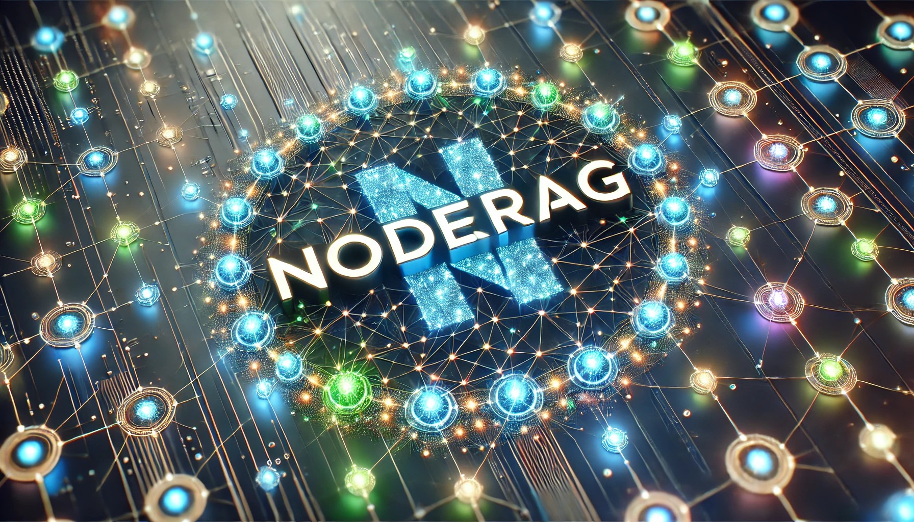
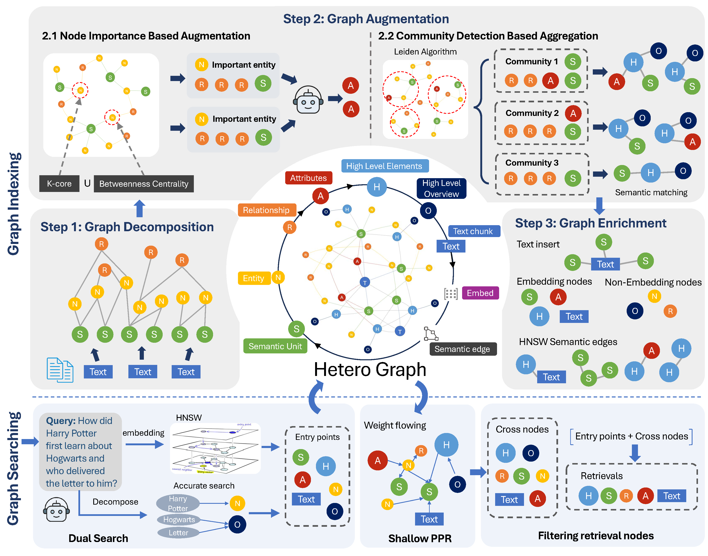
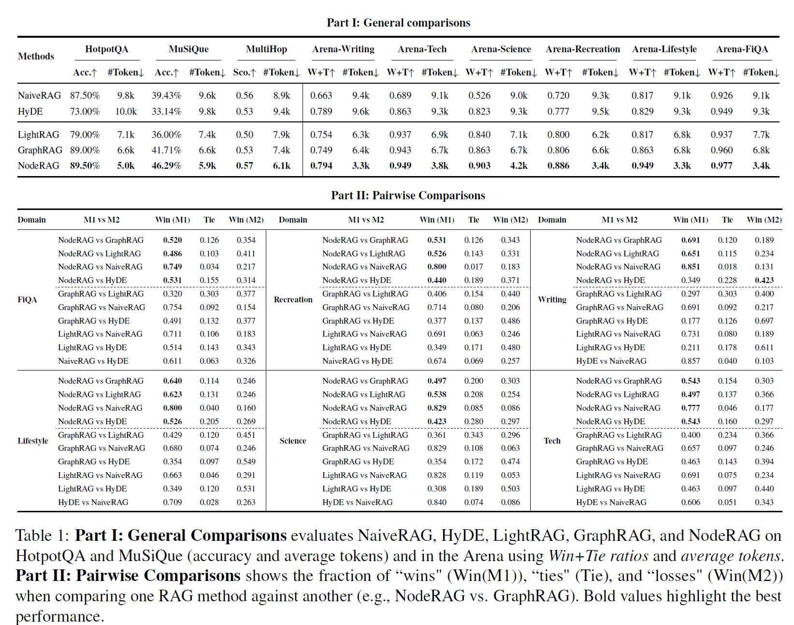
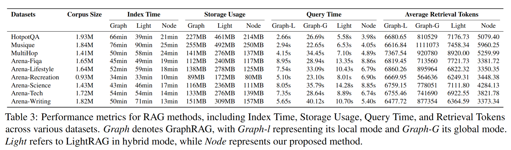

# NodeRAG: Structuring Graph-based RAG with Heterogeneous Nodes
 



🚀 NodeRAG is a heterogeneous graph-based generation and retrieval RAG system that you can install and use in multiple ways. 🖥️ We also provide a user interface (local deployment) and convenient tools for visualization generation. 


### 🧩 Workflow




---

# NodeRAG
## 🚀 Quick Start
## Prerequisites

Before installing NodeRAG from source, ensure you have the following requirements:

- Python 3.10 or higher
- Git
- Miniconda
- Additional dependencies listed in:
  - `requirements.txt` - Core dependencies
  - `requirements.in` - Development dependencies

# Start

## Environment

### Clone from source

```bash
git clone path/to/repo.git
cd NodeRAG_anonymization
```

### Conda

```bash
conda create -n NodeRAG python=3.10
conda activate NodeRAG
```

### Install

```python
pip install uv
uv pip install requirements.txt
```


## Get familiar with project construction


The NodeRAG project has the following structure. You need to manually construct this structure by creating a project folder and placing the input folder inside it. In the input folder, place the corpus you need to RAG.

```
main_folder/
├── input/
│   ├── file1.md
│   ├── file2.txt
│   ├── file3.docx
│   └── ...
```

### Key Directories

- **main_folder**: The root directory of the project.
- **input**: Contains all input files to be processed by NodeRAG. Supported file formats include: `.md`, `.doc`, and `.txt`.


### Quick Input Example
Download this [txt file](https://github.com/amephraim/nlp/blob/master/texts/J.%20K.%20Rowling%20-%20Harry%20Potter%201%20-%20Sorcerer's%20Stone.txt) as a quick example to your input folder.


## Config

```bash
python -m NodeRAG.build -f path/to/main_foulder
```
When you first use `this command`, it will create `Node_config.yaml` file in the `main_folder` directory. 


Modify the config file according to the following instructions (add API and service provider) to ensure that NodeRAG can access the correct API.

To quickly use the NodeRAG demo, set the API key for your OpenAI account. If you don't have an API key, refer to the [OpenAI Auth](https://platform.openai.com/api-keys). Ensure you enter the API key in both the `model_config` and `embedding_config` sections.


```yaml
#==============================================================================
# AI Model Configuration
#==============================================================================
model_config:
  model_name: gpt-4o-mini            # Model name for text generation
  api_keys:    # Your API key (optional)

embedding_config:
  api_keys:    # Your API key (optional)
```


## Building 
After setting up the config, rerun the following command:

```bash
python -m NodeRAG.build -f path/to/main_folder
```

The terminal will display the state tree.

Press `y` to continue. Wait for the workflow to complete. 

## Import Modules

Build a search engine quickly with minimal setup:

```python
from NodeRAG import NodeConfig, NodeSearch

# Load configuration from the main folder
config = NodeConfig.from_main_folder(r"path/main_floder")

# Initialize search engine
search = NodeSearch(config)
```

## Answer a Question

```python
# Query the system
ans = search.answer('who is harry potter?')

# 'ans' is an object with several accessible attributes:

# Response: the generated answer to your question
print(ans.response)

# Number of tokens in the answer
print(ans.response_tokens)

# Retrieval info: the context used to generate the answer
print(ans.retrieval_info)

# Number of tokens in the retrieval context
print(ans.retrieval_tokens)
```

### Notes
- `search.answer()` returns an object that encapsulates both the **answer** and the **retrieval context**, along with useful metadata.
- This method is ideal for quick integration into Python scripts or Jupyter notebooks, without setting up an API server.


## ✨ Features


#### 🔗 Enhancing Graph Structure for RAG  
NodeRAG introduces a heterogeneous graph structure that strengthens the foundation of graph-based Retrieval-Augmented Generation (RAG).


#### 🔍 Fine-Grained and Explainable Retrieval  
NodeRAG leverages HeteroGraphs to enable functionally distinct nodes, ensuring precise and context-aware retrieval while improving interpretability.

#### 🧱 A Unified Information Retrieval  
Instead of treating extracted insights and raw data as separate layers, NodeRAG integrates them as interconnected nodes, creating a seamless and adaptable retrieval system.


#### ⚡ Optimized Performance and Speed  
NodeRAG achieves faster graph construction and retrieval speeds through unified algorithms and optimized implementations.


#### 🔄 Incremental Graph Updates  
NodeRAG supports incremental updates within heterogeneous graphs using graph connectivity mechanisms.


#### 📊 Visualization and User Interface  
NodeRAG offers a user-friendly visualization system. Coupled with a fully developed Web UI, users can explore, analyze, and manage the graph structure with ease.

## ⚙️ Performance

### 📊 Benchmark Performance




*NodeRAG demonstrates strong performance across multiple benchmark tasks, showcasing efficiency and retrieval quality.*

---

### 🖥️ System Performance



*Optimized for speed and scalability, NodeRAG achieves fast indexing and query response times even on large datasets.*


